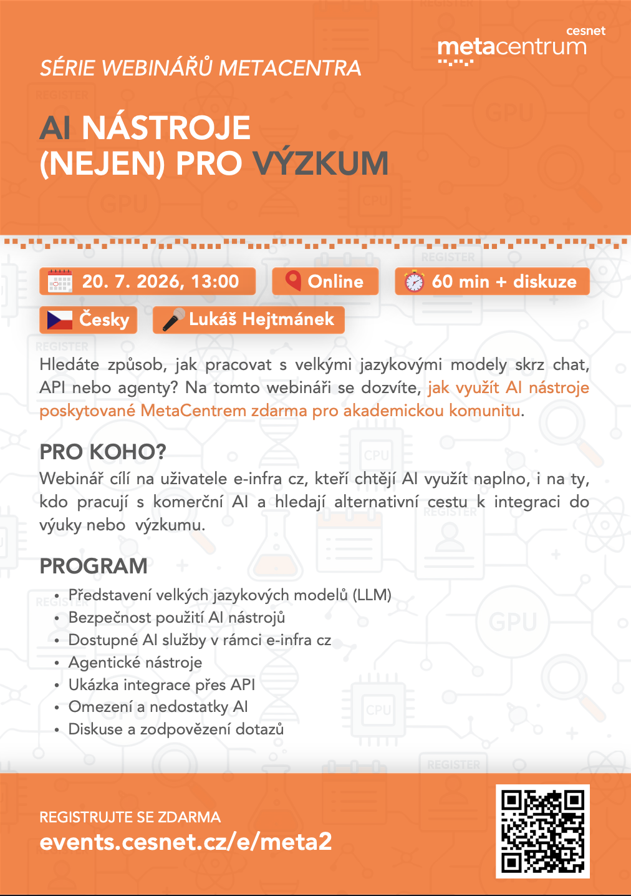

# **The MetaCentrum webinar series - Practical use of AI tools (beyond research and academia)**

This readme was created by Jiří Vorel (vorel@cesnet.cz).

Speaker: Lukáš Hejtmánek ([CERIT-SC](https://www.cerit-sc.cz/))

The information provided in this webinar is current as of 20 July 2026.

The course is held online and is taught in Czech.

