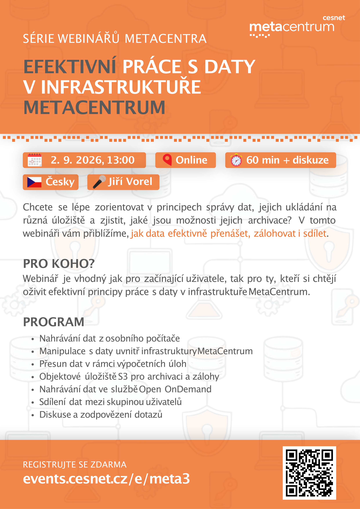

# **The MetaCentrum webinar series - Data handling**

This readme was created by Jiří Vorel (vorel@cesnet.cz).

The information provided in this webinar is current as of 2 September 2026.

The course is held online and is taught in Czech.

<p align="center"></p>

## Useful links
- [MetaCentrum](https://www.metacentrum.cz/cs/)
- [CESNET](https://www.cesnet.cz/)
- [e-INFRA CZ](https://www.e-infra.cz/)
- [e-INFRA CZ documentation](https://docs.e-infra.cz/)
- [Contact for MetaCentrum user support](https://docs.metacentrum.cz/en/docs/support)
- [MetaCentrum documentation](https://docs.metacentrum.cz/)
- [MetaCentrum monitoring page](https://my.metacentrum.cz/personal-view)
- [MetaCentrum hands-on courses](https://github.com/CESNET/metacentrum-hands-on)
- [MetaCentrum past seminars](https://metavo.metacentrum.cz/cs/seminars/)

## Data transfer to/from the local computer

When you don't have much data.
```shell
scp Test_data.tar.gz vorel@skirit.metacentrum.cz:
```

Do not transfer data using a frontnode that does not match the storage server.
```shell
scp Test_data.tar.gz vorel@skirit.metacentrum.cz:/storage/praha5-elixir/home/vorel/
```

The best solution is to access the storage server directly.
```shell
scp Test_data.tar.gz vorel@storage-brno2.metacentrum.cz:
```

```shell
mkdir Test_dir_for_data
```

```shell
scp Test_data.tar.gz vorel@storage-brno2.metacentrum.cz:Test_dir_for_data
```

```shell
scp -r Test_data vorel@storage-brno2.metacentrum.cz:Test_dir_for_data
```

```shell
rsync -avhP Test_data vorel@storage-brno2.metacentrum.cz:Test_dir_for_data
```

```shell
rsync -avhP Test_data vorel@storage-brno2.metacentrum.cz:Test_dir_for_data
```

```shell
rsync -avhP Test_data/* vorel@storage-brno2.metacentrum.cz:Test_dir_for_data
```

```shell
rsync -avhP Test_data/* vorel@storage-brno2.metacentrum.cz:Test_dir_for_data
```

```shell
scp vorel@skirit.metacentrum.cz:Test_data.tar.gz .
```

```shell
rsync -avhP vorel@storage-brno2.metacentrum.cz:Test_dir_for_data/Test_data.tar.gz .
```

## Data transfer between disk storage

Not perfect.
```shell
cp Test_data.tar.gz /storage/praha5-elixir/home/vorel
```

```shell
mv Test_data.tar.gz /storage/praha5-elixir/home/vorel
```

The best way.
```shell
scp Test_data.tar.gz storage-praha5-elixir.metacentrum.cz:
```

```shell
scp -r Test_data storage-praha5-elixir.metacentrum.cz:
```

Send data between two disk storage.
```shell
ssh storage-praha5-elixir.metacentrum.cz 'scp Test_data.tar.gz storage-vestec1-elixir.metacentrum.cz:'
```

```shell
ssh storage-praha5-elixir.metacentrum.cz 'rsync -avhP Test_data.tar.gz storage-vestec1-elixir.metacentrum.cz:'
```

## Sending data to the $SCRATCHDIR

```shell
qsub -I -l scratch_local=5gb
```

```shell
cd $SCRATCHDIR
```

Not perfect.
```shell
cp /storage/brno2/home/vorel/Test_data.tar.gz .
```

The best way.
```shell
scp storage-brno2.metacentrum.cz:Test_data.tar.gz .
```

```shell
rsync -avhP storage-brno2.metacentrum.cz:Test_data.tar.gz .
```

```shell
cp Test_data.tar.gz /storage/brno2/home/vorel
```

```shell
scp Test_data.tar.gz storage-brno2.metacentrum.cz:
```

```shell
scp -r Test_data storage-brno2.metacentrum.cz:
```

## Accessing S3 storage

```shell
s3cmd ls
```

```shell
s3cmd -c /storage/brno2/home/vorel/.s3cfg ls
```

```shell
s3cmd ls s3://meta-archive
```

```shell
s3cmd mb s3://testbucket
```

```shell
s3cmd ls
```

```shell
s3cmd ls s3://testbucket
```

```shell
s3cmd rb s3://testbucket
```

```shell
s3cmd ls
```

```shell
s3cmd put Test_data.tar.gz s3://meta-archive
```

```shell
s3cmd ls s3://meta-archive
```

```shell
s3cmd put -r Test_data s3://meta-archive
```

```shell
s3cmd ls s3://meta-archive
```

```shell
s3cmd ls s3://meta-archive/Test_data/
```

```shell
s3cmd get s3://meta-archive/Test_data.tar.gz
```

```shell
s3cmd get --skip-existing s3://meta-archive/Test_data.tar.gz
```

```shell
s3cmd get --force s3://meta-archive/Test_data.tar.gz
```

```shell
s3cmd del s3://meta-archive/Test_data.tar.gz
```

```shell
s3cmd del -r s3://meta-archive/Test_data/
```

```shell
s3cmd ls s3://meta-archive
```

## Data sharing

```shell
mkdir test_shared_dir
```

```shell
chmod 700 test_shared_dir
```

```shell
share-dir-nfsfacl show test_shared_dir
```

```shell
share-dir-nfsfacl readwrite test_shared_dir leontovyc_roman
```

```shell
share-dir-nfsfacl show test_shared_dir
```

```shell
share-dir-nfsfacl list
```

```shell
share-dir-nfsfacl readwrite -r test_shared_dir leontovyc_roman
```

```shell
share-dir-nfsfacl list
```

```shell
share-dir-nfsfacl read -r test_shared_dir echo2
```

```shell
share-dir-nfsfacl undo -r test_shared_dir echo2
```

```shell
share-dir-nfsfacl undo -r test_shared_dir leontovyc_roman
```

```shell
share-dir-nfsfacl show test_shared_dir
```
