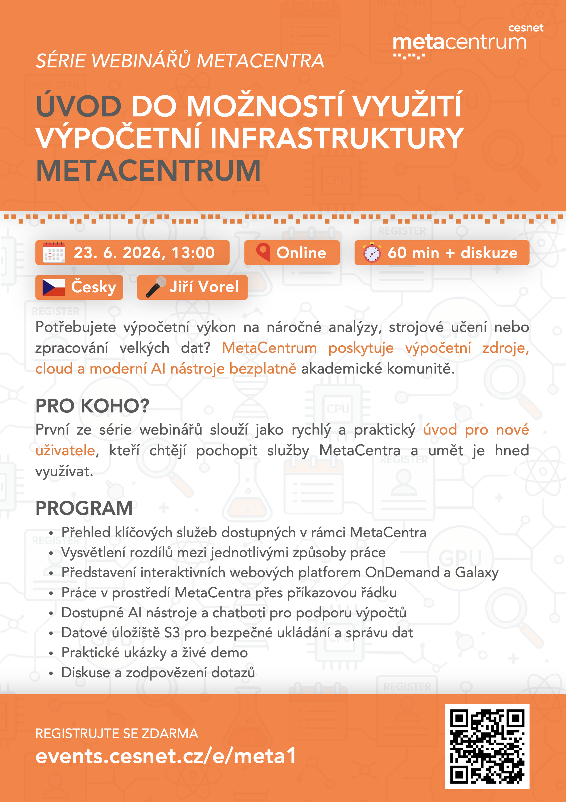

# The MetaCentrum webinar series

## 1. [Introduction to MetaCentrum](01_Introduction-Meta.md), 23. 6. 2026
- [Registration](https://metavo.metacentrum.cz/cs/news/novinka_2026_0010.html)
- The course is held online and is taught in Czech.

## 2. LLM, 20. 7. 2026
